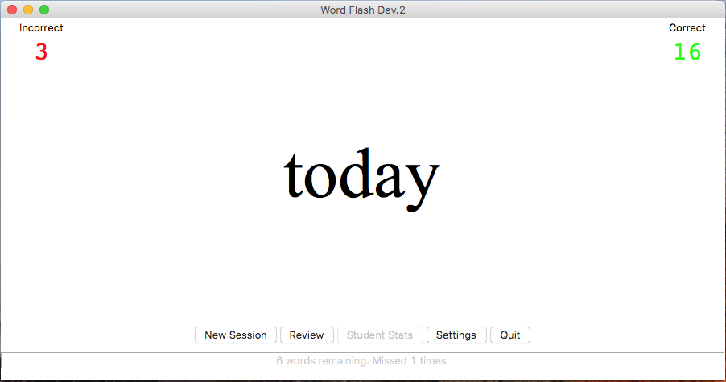

# Word Flash
> A simple flash card style study tool I created to help my daughter learn to read.

## *New Python developers are welcome and encouraged to contribute to this project!*

### Features
- 38 word lists with 1174 sight words and phonics combinations
- Flash card style interface
- Student progress tracking
- Fully customizable Word Lists

*Planned Features*
- Support for multiple students
- Student progress & trend analysis
- Dynamic Word List creation based on student progress

### How to Use Word Flash
Select the *New Session* button to start a study session. Word Flash will read the word lists and display "Ready!". To begin, press the left arrow key on your keyboard. The first word from the active word list will be shown. 

After the student attempts to read the word, press the Right Arrow key to register a correct answer, or the Left Arrow key for an incorrect answer. One point will be added to either the Correct or Incorrect score.

*Pressing either the Right or Left Arrow key will advance to the next word in the list. You cannot go back to a previous word.*

After the last word is displayed, "All done!" will be shown on the screen. If the student missed any words, the *Review* button will be activated. Selecting the *Review* button will start a special session using the Missed Words list from the previous session.

### Settings
Click the *Settings* button to open the Settings window.

Choose the Word List you want to use by selecting the check mark next to each option. You can choose as many Word Lists as you like. You may also choose to shuffle the words in the list.

No changes will be made until you click *Okay*. If you change your mind, you can cancel your changes by simply clicking the close (X) button on the Settings window.

***NOTE:** You must restart Word Flash to show or hide the Score Board or Status Bar. A bug issue has been created.*

### Advanced Customization
You can make changes to the standard Word Lists and even add your own customized Word Lists by editing the word_flash.ini file. You'll want to be very careful when making changes. If any of the original entries are changed, Word Flash will likely fail to operate correctly. Before making any changes it is highly recomended that you make a backup of the known good .ini settings file.

Each entry in the '''[WordList]''' section must have a corresponding entry in the '''[WordFiles]''' section. You may add as many custom entries as you like, however, these custom entries will not be available in the Settings window. To activate or deactivate a custom entry, you must use a True or False boolean value. In the main Word Flash window, you will see your custom list is active in the Status Bar.

Only boolean values (True or False) are accepted in the '''[WordList]''' section.

Only string values naming .txt files are accepted in the '''[WordFiles]''' section.

***NOTE:** Double check any changes made to the .ini files as there is currently no error checking for bad entries.*

### FAQ
**Why use .ini files instead of a database (or JSON)?**
Even though .ini files are not as efficient as a database, I opted to use .ini files for the sake of transparency. The data collected is related to very young children, so there is a responsibility to keep all information recorded in a transparent, human-readable format. Formats like JSON are more efficient, but I also need the files to be easily editable by non-technical teachers/instructors. I'm currently looking into possibilities with CSV files.
